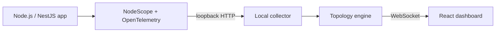

# NodeScope

NodeScope is a local-first runtime architecture explorer for Node.js applications. It instruments the boundaries your application actually executes and turns completed traces into a live, aggregated topology:

```text
POST /payments → PaymentsController → PaymentsService → PostgreSQL
```

It is not a static dependency diagram. A component appears only after it runs, and repeated traffic updates the same stable nodes and edges instead of duplicating them.

> **Local by design:** the collector binds to `127.0.0.1`, telemetry stays in memory, and no data is sent to NodeScope, a cloud service, analytics, or a remote collector.

## Quick start

This repository ships as a Yarn workspace.

```bash
yarn install
yarn demo
```

Open [http://127.0.0.1:7331](http://127.0.0.1:7331), then generate traffic:

```bash
curl -X POST http://127.0.0.1:3000/payments \
  -H 'content-type: application/json' \
  -d '{"amount":125,"currency":"USD"}'
```

To exercise the error path:

```bash
curl -X POST http://127.0.0.1:3000/payments \
  -H 'content-type: application/json' \
  -d '{"fail":true}'
```

The intended package UX is already represented by the CLI:

```bash
npx nodescope dev -- npm run start:dev
```

The CLI starts the local collector/dashboard, adds the ESM preload through `NODE_OPTIONS`, launches the application command with inherited stdio, and forwards termination signals.

## Why NodeScope

Static diagrams explain what code *can* call. NodeScope answers what a local request *did* call, how long each architectural boundary took, and where errors occurred. It is designed for debugging request flows in NestJS and Express services without tracing every function.

## Architecture



The workspace intentionally keeps the MVP boundaries small:

- `packages/protocol` — normalized telemetry, topology, trace, runtime, and WebSocket contracts.
- `packages/topology-engine` — stable identity, aggregation, percentile metrics, trace correlation, and bounded retention.
- `packages/core` — an escape hatch for architectural boundaries auto-instrumentation cannot observe.
- `packages/instrumentation-node` — OpenTelemetry SDK, standard Node auto-instrumentations, local exporter, and runtime metrics.
- `packages/instrumentation-nestjs` — one global interceptor that adds controller semantics without per-controller decorators.
- `apps/collector` — loopback ingestion/API, in-memory state, static dashboard serving, and WebSocket broadcast.
- `apps/dashboard` — live React Flow topology, node inspection, runtime summary, and trace waterfall.
- `packages/cli` — collector lifecycle, instrumentation injection, child process lifecycle, and signal forwarding.
- `apps/demo-nestjs` — the `POST /payments` proof with controller, service, and PostgreSQL boundary spans.

## Instrumentation model

NodeScope starts the OpenTelemetry Node SDK before the application loads. Standard auto-instrumentations cover incoming/outgoing HTTP and supported client libraries such as PostgreSQL, MongoDB, Redis, and AMQP when those libraries are present.

NestJS controller semantics come from a global interceptor:

```ts
@Module({ imports: [NodeScopeModule] })
export class AppModule {}
```

Service methods are not observable from standard OpenTelemetry because NestJS has no universal service-call hook. For the MVP, a narrow boundary helper is available instead of patching every provider or tracing every JavaScript function:

```ts
return traceServiceOperation('PaymentsService', () => this.repository.save(input));
```

Real `pg` queries are captured by OpenTelemetry automatically. The demo uses a timed PostgreSQL boundary so the full pipeline can run without Docker; replacing it with `pg` requires no collector or dashboard changes.

## Metrics and retention

Nodes and edges expose request count, errors, error rate, average latency, and p95 latency. The dashboard also shows process RSS/heap, CPU, event-loop utilization, and uptime where available.

Topology metrics live in process memory. Latency samples are capped at 1,000 per node/edge, and recent traces default to 50. Restarting NodeScope clears all data.

## Supported integrations

The OpenTelemetry preload enables instrumentation for:

- Node.js HTTP servers and clients
- Express and NestJS request handling
- outgoing HTTP and `fetch`
- PostgreSQL (`pg`), MongoDB, Redis, and RabbitMQ (`amqplib`) when installed by the application
- explicit controller/service/database/queue/worker boundaries through NodeScope metadata

The Phase 1 demo and automated end-to-end verification focus on HTTP → NestJS controller → service → PostgreSQL.

## Development

```bash
yarn build
yarn test
yarn lint
```

The codebase uses strict TypeScript. Unit tests cover stable node/edge aggregation, averages, p95, errors, out-of-order correlation, and bounded trace retention. The collector integration test proves telemetry ingestion creates topology nodes and an edge.

## Current limitations

- State is process-local and intentionally ephemeral.
- Service/provider semantics require the boundary helper; standard auto-instrumentation cannot safely infer arbitrary provider calls.
- The demo simulates the PostgreSQL boundary instead of requiring a container.
- One local application process/collector is assumed.
- No filtering, persistence, authentication, remote access, or production deployment is included.

## Roadmap (not implemented)

### v0.2

- Validate and refine MongoDB, Redis, RabbitMQ, and additional database visual semantics
- Improve external HTTP destination naming

### v0.3

- Richer trace explorer
- Route and dependency filters
- p50/p95/p99
- More detailed request animations

### v0.4

- Multiple Node.js processes and service grouping

Cloud accounts, remote telemetry, production hosting, Kubernetes integration, API keys, and SaaS features are explicitly outside the local-first scope.
