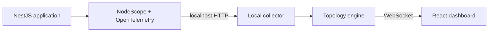

# NodeScope

**See what your NestJS application actually does when a request runs.**

NodeScope is a local-first runtime architecture explorer for Node.js and NestJS applications. It captures real application traffic and displays the executed path as a live topology graph.

For example, when a developer sends `POST /payments`, NodeScope can display:

```text
POST /payments
      ↓
PaymentsController
      ↓
PaymentsService
      ↓
PostgreSQL
```

NodeScope is not a static dependency diagram. A component appears only after it executes. Repeated requests update the metrics on the same nodes and connections instead of creating duplicates.

> **No business-function wrappers required.** NestJS controllers and singleton application
> providers are discovered and instrumented automatically during application bootstrap.

## What NodeScope helps you understand

NodeScope gives developers a visual answer to questions such as:

- Which controller and service handled this request?
- Which databases, queues, caches, or external APIs were called?
- Which dependency is slow?
- Where did an error happen?
- How often is a route or dependency used?
- What did one individual request do from start to finish?

The local dashboard includes:

- A live runtime topology graph
- Request and error counts
- Average and p95 latency
- Error rate
- Recent request traces and architectural waterfalls
- Process memory, CPU, event-loop utilization, and uptime
- Node details and connected dependencies

## Local-first and private

NodeScope is designed for local development.

- The collector listens on `127.0.0.1`.
- Telemetry remains on the developer's machine.
- Runtime data is stored only in memory.
- Restarting NodeScope clears the captured data.
- NodeScope does not include analytics, cloud synchronization, accounts, API keys, or a remote collector.

Do not expose the NodeScope collector or dashboard to a public network.

## How it works



The NodeScope CLI starts the collector and dashboard, injects OpenTelemetry before the application starts, launches the normal development command, and forwards termination signals to the child process.

## Release status

NodeScope is currently an MVP source preview. The packages in this repository are marked `private` and have not yet been published to the npm registry.

You can run the included demo from this repository today. The customer installation commands in
the next section describe the intended npm package experience. Publishing the packages and bundling
the dashboard assets for installed CLI usage remain release tasks.

## Try the included demo

Requirements:

- Node.js 20 or newer
- Yarn Classic 1.22

From this repository:

```bash
yarn install
yarn demo
```

NodeScope starts:

```text
Demo application:  http://127.0.0.1:3000
Runtime dashboard: http://127.0.0.1:7331
```

Open [http://127.0.0.1:7331](http://127.0.0.1:7331), then create a payment:

```bash
curl -X POST http://127.0.0.1:3000/payments \
  -H 'content-type: application/json' \
  -d '{"amount":125,"currency":"USD"}'
```

The dashboard will show:

```text
POST /payments → PaymentsController → PaymentsService → PostgreSQL
```

To verify error visualization:

```bash
curl -X POST http://127.0.0.1:3000/payments \
  -H 'content-type: application/json' \
  -d '{"fail":true}'
```

## Install in a NestJS application

> The following installation commands apply after the NodeScope packages are published to npm.

Install the CLI and NestJS integration as development dependencies:

```bash
yarn add --dev nodescope @nodescope/instrumentation-nestjs
```

NodeScope expects an existing NestJS application with `@nestjs/common`, `@nestjs/core`, and `rxjs` installed.

### 1. Register the NestJS integration

Import `NodeScopeModule` once in the root application module:

```ts
import { Module } from '@nestjs/common';
import { NodeScopeModule } from '@nodescope/instrumentation-nestjs';
import { PaymentsModule } from './payments/payments.module';

@Module({
  imports: [NodeScopeModule, PaymentsModule],
})
export class AppModule {}
```

The module installs one global controller interceptor and discovers eligible application providers
once during bootstrap. You do not need to add NodeScope decorators to controllers, routes, or
services.

### 2. Keep normal business code

NodeScope safely wraps eligible singleton provider prototype methods after NestJS creates them. The
service remains normal application code:

```ts
import { Injectable } from '@nestjs/common';

@Injectable()
export class PaymentsService {
  constructor(private readonly paymentsRepository: PaymentsRepository) {}

  createPayment(input: CreatePaymentInput) {
    return this.paymentsRepository.create(input);
  }
}
```

Calling `PaymentsService.createPayment()` creates a semantic service span automatically. If that
method calls `WalletService.withdraw()`, their parent/child relationship is preserved through the
OpenTelemetry async context.

The main topology aggregates all methods under the provider class:

```text
PaymentsService.createPayment
PaymentsService.validatePayment   → topology node: PaymentsService
PaymentsService.calculateFees
```

The trace explorer retains each executed method name and duration.

### 3. Use your database normally

Compatible PostgreSQL clients are captured by OpenTelemetry. No NodeScope-specific database call is required:

```ts
return this.dataSource.query(
  'INSERT INTO payments (amount, currency) VALUES ($1, $2) RETURNING id',
  [input.amount, input.currency],
);
```

### 4. Start the application through NodeScope

Run the same command you normally use for local development:

```bash
yarn nodescope dev -- yarn start:dev
```

The CLI automatically injects the NodeScope OpenTelemetry preload through `NODE_OPTIONS`. The
developer does not need to export it manually.

You can also add a reusable script to the NestJS application's `package.json`:

```json
{
  "scripts": {
    "start:dev": "nest start --watch",
    "start:scope": "nodescope dev -- yarn start:dev"
  }
}
```

Then run:

```bash
yarn start:scope
```

NodeScope prints the dashboard address:

```text
NodeScope started

Application command:
yarn start:dev

Runtime map:
http://127.0.0.1:7331

Press Ctrl+C to stop.
```

### 5. Generate application traffic

Use the application normally, run an integration test, or send a request with `curl`. Only executed components appear in the dashboard.

The first request should produce a path similar to:

```text
HTTP route → Controller → Service → Database
```

Press `Ctrl+C` in the NodeScope terminal to stop both the application and local collector.

## Optional custom spans

Automatic instrumentation covers normal controller and provider visibility. Install
`@nodescope/core` only when a custom domain operation or unsupported infrastructure boundary needs
extra trace detail:

```bash
yarn add --dev @nodescope/core
```

Use `nodescope.span()` for trace detail that should not become a main topology node:

```ts
import { nodescope } from '@nodescope/core';

return nodescope.span('calculate-settlement', () => this.calculateSettlement(input));
```

If an internal library or unsupported client is not automatically visible, mark its architectural
boundary explicitly:

```ts
import { traceBoundary } from '@nodescope/core';

return traceBoundary(
  {
    type: 'database',
    name: 'PostgreSQL',
    identity: 'database:postgresql:payments',
    operation: 'INSERT payments',
  },
  () => this.customDatabaseClient.insert(payment),
);
```

The `identity` must remain stable. Do not include payment IDs, player IDs, timestamps, or other request-specific values.

## What is captured

| Boundary                        | Behavior                                                         |
| ------------------------------- | ---------------------------------------------------------------- |
| Incoming HTTP                   | Captured automatically when the app starts through NodeScope     |
| NestJS controllers              | Captured after importing `NodeScopeModule`                       |
| NestJS singleton providers      | Discovered and instrumented automatically during bootstrap       |
| PostgreSQL                      | Captured through compatible OpenTelemetry client instrumentation |
| MongoDB                         | Captured when a compatible instrumented client is used           |
| Redis                           | Captured when a compatible instrumented client is used           |
| RabbitMQ/AMQP                   | Captured when a compatible `amqplib` integration is used         |
| Outgoing HTTP and `fetch`       | Captured automatically where supported                           |
| Custom trace detail             | Optionally use `nodescope.span()`                                |
| Custom architectural boundaries | Optionally use `traceBoundary`                                   |

NodeScope instruments architectural boundaries. It does not trace every JavaScript function.

## Dashboard metrics

Each topology node and edge maintains:

- Request count
- Error count
- Error rate
- Average latency
- p95 latency

Recent traces are stored separately from the aggregated graph so a developer can inspect one request without creating duplicate topology nodes.

Storage is intentionally bounded:

- Up to 50 recent traces by default
- Up to 1,000 latency samples per node or edge
- No NodeScope database or persistent telemetry storage

## Configuration

NodeScope works without configuration for the standard local setup.

Optional NestJS filtering is available through `forRoot()`:

```ts
@Module({
  imports: [
    NodeScopeModule.forRoot({
      tracing: {
        services: true,
        controllers: true,
        excludeProviders: ['ConfigService', 'InternalHealthService'],
        minDurationMs: 1,
      },
    }),
  ],
})
export class AppModule {}
```

`excludeProviders` accepts exact class names. `minDurationMs` keeps faster method spans as internal
correlation spans so trivial methods do not clutter the topology or trace explorer.

| Environment variable     | Default                  | Purpose                                     |
| ------------------------ | ------------------------ | ------------------------------------------- |
| `NODESCOPE_PORT`         | `7331`                   | Collector and dashboard port                |
| `NODESCOPE_SERVICE_NAME` | Application package name | Name reported by the instrumented process   |
| `NODESCOPE_DEBUG`        | Disabled                 | Set to `1` to log telemetry export failures |

Example:

```bash
NODESCOPE_PORT=7441 \
NODESCOPE_SERVICE_NAME=payments-api \
yarn nodescope dev -- yarn start:dev
```

The dashboard will be available at `http://127.0.0.1:7441`.

## Troubleshooting

### The dashboard is empty

Confirm that:

1. The application was started through `nodescope dev`.
2. A real request was sent after NodeScope started.
3. `NodeScopeModule` is imported by the root NestJS module.
4. The application process can reach `127.0.0.1:7331`.

Routes only appear after they execute.

### Routes and controllers appear, but services do not

Confirm that the provider is a singleton class with methods declared on its direct prototype.
Request-scoped providers, transient providers, inherited methods, accessors, and arrow functions
assigned as instance properties are intentionally skipped in the MVP. You can use an optional
custom span for an unsupported case.

### The database does not appear

Check whether the application uses a client supported by the OpenTelemetry Node auto-instrumentations. If the database is hidden behind a custom wrapper or unsupported client, use `traceBoundary` around the architectural database operation.

### Port 7331 is already in use

Choose another local port:

```bash
NODESCOPE_PORT=7441 yarn nodescope dev -- yarn start:dev
```

### No telemetry arrives

Run with debug logging:

```bash
NODESCOPE_DEBUG=1 yarn nodescope dev -- yarn start:dev
```

## Current MVP limitations

- The npm packages are not published yet.
- State is process-local and is cleared on restart.
- Automatic provider discovery currently instruments singleton class providers created during bootstrap.
- Request-scoped and transient providers are skipped to avoid unsafe instance mutation.
- Inherited methods and arrow functions stored as instance properties are not automatically wrapped.
- Getters, setters, lifecycle hooks, framework providers, and NodeScope providers are intentionally skipped.
- Providers dynamically created after application bootstrap are not discovered in the MVP.
- The included demo simulates a PostgreSQL operation so Docker is not required.
- One local application process and one collector are assumed.
- MongoDB, Redis, RabbitMQ, and external HTTP naming still need broader compatibility testing.
- Filtering, persistence, authentication, remote access, Kubernetes integration, and production deployment are not implemented.

## Repository development

Install dependencies and validate the workspace with Yarn:

```bash
yarn install
yarn format
yarn format:check
yarn build
yarn lint
yarn test
```

`yarn format` applies the shared Prettier rules to the entire workspace, while
`yarn format:check` verifies formatting without changing files. The test suite covers stable
topology aggregation, latency and p95 calculations, error metrics, out-of-order trace correlation,
bounded trace retention, and collector ingestion.

## Roadmap

### v0.2

- Validate more PostgreSQL, MongoDB, Redis, and RabbitMQ client versions
- Improve external HTTP destination naming
- Simplify package publication and customer installation

### v0.3

- Route and dependency filtering
- A richer trace explorer
- p50, p95, and p99 latency
- Improved request animations

### v0.4

- Multiple Node.js processes
- Service and process grouping

NodeScope will remain local-first. Cloud accounts, remote telemetry, and SaaS features are outside the current product scope.
