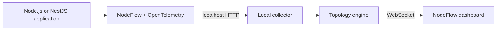

# NodeFlow

**See how your Node.js application actually flows.**

NodeFlow is a local-first runtime architecture explorer for Node.js and NestJS applications. It
captures real application traffic and turns executed runtime paths into a live architecture map.

```text
POST /payments
      ↓
PaymentsController
      ↓
PaymentsService
     ↙              ↘
Redis             PostgreSQL
                       ↓
                   RabbitMQ
```

NodeFlow is not a static dependency diagram. Components appear only after they execute. Repeated
requests update the metrics on the same nodes and connections instead of creating duplicates.

> **No business-function wrappers required.** No NodeFlow decorators, initialization calls, manual
> OpenTelemetry configuration, or tracing calls are required in normal controller and service
> code.

## What NodeFlow helps you understand

NodeFlow gives developers a visual answer to questions such as:

- Which controller and service handled this request?
- Which databases, queues, caches, or external APIs were called?
- Which dependency is slow?
- Where did an error happen?
- How often is a route or dependency used?
- What did one individual request do from start to finish?

The local dashboard includes:

- A live runtime topology graph
- Request and error counts
- Average and p95 latency
- Error rate
- Recent request traces and architectural waterfalls
- Process memory, CPU, event-loop utilization, and uptime
- Node details and connected dependencies

## Local-first and private

NodeFlow is designed for local development.

- The collector binds to `127.0.0.1`.
- Telemetry remains on the developer's machine.
- Runtime data is stored only in memory.
- Restarting NodeFlow clears the captured data.
- There are no accounts, API keys, analytics, cloud synchronization, or remote collectors.

Do not expose the NodeFlow collector or dashboard to a public network.

## How it works



The CLI starts the collector and bundled dashboard, configures the preload, and launches the
developer's normal command. The preload initializes OpenTelemetry before application libraries are
loaded. OpenTelemetry instruments supported infrastructure clients, while NodeFlow adds semantic
controller and provider boundaries and aggregates completed traces into a runtime map.

## Release status

NodeFlow is currently an MVP source preview and has not yet been published to npm. Its public
package surface, transitive runtime packages, CLI binary, exports, bundled dashboard, package smoke
tests, Changesets configuration, and npm trusted-publishing workflow are prepared for the
`@mshamed1` npm scope, with `@mshamed1/node-flow` as the primary package.

NodeFlow is licensed under Apache License 2.0. See [RELEASE.md](./RELEASE.md) for the one-time npm
bootstrap and the automated release process.

## Install in a NestJS application

Requirements:

- Node.js 20 or newer
- An existing NestJS application with `@nestjs/common`, `@nestjs/core`, and `rxjs`

Install one development dependency:

```bash
npm install -D @mshamed1/node-flow
```

### 1. Register the NestJS integration

Import `NodeFlowModule` once in the root application module:

```ts
import { Module } from '@nestjs/common';
import { NodeFlowModule } from '@mshamed1/node-flow/nestjs';
import { PaymentsModule } from './payments/payments.module';

@Module({
  imports: [NodeFlowModule, PaymentsModule],
})
export class AppModule {}
```

This is the only required application-source integration. The module installs one global
controller interceptor and discovers eligible singleton application providers once during
bootstrap.

### Why the NestJS module is still required

NodeFlow intentionally does not fake zero configuration by patching undocumented NestJS internals.
`NodeFlowModule` uses stable framework extension points:

- The public `DiscoveryModule` registers the public `DiscoveryService` in the application DI graph.
- Provider discovery runs once through the public `OnApplicationBootstrap` lifecycle.
- Controller visibility is registered through the public `APP_INTERCEPTOR` token.

A Node preload can activate NestJS request instrumentation, but NestJS does not expose a public
global observer that provides the completed application container and provider instances. Removing
the module today would require wrapping `NestFactory.create` and depending on internal container and
instance-wrapper behavior. Reliability across NestJS releases is more important than hiding one
explicit module import.

### 2. Keep normal business code

Services remain normal NestJS code:

```ts
import { Injectable } from '@nestjs/common';

@Injectable()
export class PaymentsService {
  constructor(private readonly paymentsRepository: PaymentsRepository) {}

  createPayment(input: CreatePaymentInput) {
    return this.paymentsRepository.create(input);
  }
}
```

NodeFlow safely instruments eligible singleton provider prototype methods after NestJS creates
their instances. Nested provider calls preserve their parent-child relationship through the active
OpenTelemetry context.

The topology aggregates provider methods under one stable class node:

```text
PaymentsService.createPayment
PaymentsService.validatePayment   → topology node: PaymentsService
PaymentsService.calculateFees
```

Individual traces retain the executed method names and durations.

### 3. Use infrastructure clients normally

Compatible clients are captured by OpenTelemetry. No NodeFlow-specific database call is required:

```ts
return this.dataSource.query(
  'INSERT INTO payments (amount, currency) VALUES ($1, $2) RETURNING id',
  [input.amount, input.currency],
);
```

### 4. Run through NodeFlow

After installing the package, use its local binary through `npx`:

```bash
npx node-flow dev -- npm run start:dev
```

Yarn users can invoke the same local binary directly:

```bash
yarn node-flow dev -- yarn start:dev
```

The CLI prints:

```text
NodeFlow started

Application command:
npm run start:dev

Runtime map:
http://127.0.0.1:7331

Press Ctrl+C to stop.
```

The CLI resolves the installed NodeFlow preload, preserves existing `NODE_OPTIONS`, avoids duplicate
preload entries, and launches the application with `NODEFLOW_COLLECTOR_URL`. Developers do not need
to configure `NODE_OPTIONS` themselves.

Open [http://127.0.0.1:7331](http://127.0.0.1:7331), then use the application normally or generate
traffic with integration tests and `curl`. Only executed components appear.

## Optional custom spans

Automatic instrumentation covers normal controllers, singleton providers, and supported
infrastructure clients. The public package also exposes optional APIs for domain-specific detail or
unsupported clients.

Use `nodeflow.span()` for trace detail that should not become a main topology node:

```ts
import { nodeflow } from '@mshamed1/node-flow';

return nodeflow.span('calculate-settlement', () => this.calculateSettlement(input));
```

Use `traceBoundary()` only when an unsupported client needs an explicit architectural boundary:

```ts
import { traceBoundary } from '@mshamed1/node-flow';

return traceBoundary(
  {
    type: 'database',
    name: 'PostgreSQL',
    identity: 'database:postgresql:payments',
    operation: 'INSERT payments',
  },
  () => this.customDatabaseClient.insert(payment),
);
```

Keep `identity` stable. Do not include payment IDs, player IDs, timestamps, or other
request-specific values.

## What is captured

| Boundary                        | Behavior                                                      |
| ------------------------------- | ------------------------------------------------------------- |
| Incoming HTTP                   | Captured automatically when the app starts through NodeFlow   |
| NestJS controllers              | Captured after importing `NodeFlowModule`                     |
| NestJS singleton providers      | Discovered and instrumented once during application bootstrap |
| PostgreSQL                      | Captured through compatible OpenTelemetry instrumentation     |
| MongoDB                         | Captured when a compatible instrumented client is used        |
| Redis                           | Captured when a compatible instrumented client is used        |
| RabbitMQ/AMQP                   | Captured when compatible `amqplib` instrumentation is used    |
| Outgoing HTTP and `fetch`       | Captured automatically where supported                        |
| Custom trace detail             | Optionally use `nodeflow.span()`                              |
| Custom architectural boundaries | Optionally use `traceBoundary()`                              |

NodeFlow instruments architectural boundaries. It does not trace every JavaScript function.

## Dashboard metrics and storage

Each topology node and edge maintains request count, error count, error rate, average latency, and
p95 latency. Recent traces are stored separately from the aggregated graph so developers can inspect
individual requests without creating duplicate topology nodes.

Storage is intentionally bounded and process-local:

- Up to 50 recent traces by default
- Up to 1,000 latency samples per node or edge
- No NodeFlow database or persistent telemetry storage

## Optional configuration

NodeFlow works without configuration for the standard local setup. Filtering is available through
`forRoot()`:

```ts
import { NodeFlowModule } from '@mshamed1/node-flow/nestjs';

@Module({
  imports: [
    NodeFlowModule.forRoot({
      tracing: {
        services: true,
        controllers: true,
        excludeProviders: ['ConfigService', 'InternalHealthService'],
        minDurationMs: 1,
      },
    }),
  ],
})
export class AppModule {}
```

`excludeProviders` accepts exact class names. `minDurationMs` keeps faster provider method spans as
internal correlation spans. If a standalone configuration file is added later, the preferred
filename is `nodeflow.config.ts`.

## Environment variables

| Environment variable    | Default                  | Purpose                                     |
| ----------------------- | ------------------------ | ------------------------------------------- |
| `NODEFLOW_PORT`         | `7331`                   | Collector and dashboard port                |
| `NODEFLOW_SERVICE_NAME` | Application package name | Name reported by the instrumented process   |
| `NODEFLOW_DEBUG`        | Disabled                 | Set to `1` to log telemetry export failures |

Example:

```bash
NODEFLOW_PORT=7441 \
NODEFLOW_SERVICE_NAME=payments-api \
node-flow dev -- npm run start:dev
```

The dashboard will be available at `http://127.0.0.1:7441`.

## NestJS monorepos

Install `@mshamed1/node-flow` in the workspace that owns the NestJS application, import
`NodeFlowModule` in that application's root module, and launch that workspace through NodeFlow.

For a Yarn Classic workspace named `@acme/payments-api`:

```bash
yarn workspace @acme/payments-api add --dev @mshamed1/node-flow
yarn workspace @acme/payments-api node-flow dev -- yarn workspace @acme/payments-api start:dev
```

For an npm workspace at `apps/payments-api`:

```bash
npm install --save-dev @mshamed1/node-flow --workspace apps/payments-api
cd apps/payments-api
npx node-flow dev -- npm run start:dev
```

The preload is inherited by child Node.js processes through `NODE_OPTIONS`. When developing several
services simultaneously, start one NodeFlow command per service and assign each collector a unique
`NODEFLOW_PORT`. The current MVP does not merge multiple collectors into one dashboard.

A single NestJS application in a monorepo is fully supported. For example, launching an `api`
application instruments that application and singleton providers imported from `libs/*` when
NestJS instantiates them in the `api` container. NodeFlow follows executed runtime boundaries, not
the physical workspace directory that contains a provider.

Running `api`, `worker`, and `admin-api` together and merging all three processes into one unified
topology is not supported yet. Multi-process service grouping is a future capability.

## Try the included demo

Repository development uses Yarn Classic 1.22:

```bash
yarn install
yarn demo
```

NodeFlow starts the demo on `http://127.0.0.1:3000` and the runtime map on
`http://127.0.0.1:7331`.

Create a payment:

```bash
curl -X POST http://127.0.0.1:3000/payments \
  -H 'content-type: application/json' \
  -d '{"amount":125,"currency":"USD"}'
```

The dashboard will show:

```text
POST /payments → PaymentsController → PaymentsService → PostgreSQL
```

The demo simulates PostgreSQL through optional `traceBoundary()` so Docker is not required. Its
controller and service contain no tracing calls.

## Troubleshooting

### The dashboard is empty

Confirm that:

1. The application was started through `node-flow dev`.
2. A real request was sent after NodeFlow started.
3. `NodeFlowModule` from `@mshamed1/node-flow/nestjs` is imported by the root NestJS module.
4. The application process can reach `127.0.0.1:7331`.

### Routes and controllers appear, but services do not

The provider must be a singleton class with methods declared on its direct prototype. Request and
transient scopes, inherited methods, accessors, lifecycle hooks, and arrow functions stored as
instance properties are intentionally skipped to protect application behavior.

### The database does not appear

Check whether the client is supported by OpenTelemetry Node auto-instrumentation. Use
`traceBoundary()` only for an unsupported or custom client.

### Port 7331 is already in use

```bash
NODEFLOW_PORT=7441 node-flow dev -- npm run start:dev
```

### No telemetry arrives

```bash
NODEFLOW_DEBUG=1 node-flow dev -- npm run start:dev
```

## Current MVP limitations

- The npm packages are configured but not yet published.
- One `NodeFlowModule` import remains required because NestJS has no public preload-to-container
  discovery hook.
- State is process-local and cleared on restart.
- Automatic provider discovery covers singleton class providers created during bootstrap.
- Request-scoped, transient, and dynamically created providers are intentionally skipped.
- Inherited methods, instance arrow functions, accessors, lifecycle hooks, framework providers, and
  NodeFlow providers are skipped.
- One local application process and collector are assumed.
- MongoDB, Redis, RabbitMQ, and external HTTP naming need broader compatibility testing.

## Repository development

```bash
yarn install --frozen-lockfile
yarn format:check
yarn build
yarn lint
yarn test
yarn package:check
yarn package:smoke
```

Use `yarn format` to apply Prettier. Contributors should read [CONTRIBUTING.md](./CONTRIBUTING.md) and
add a Changeset for user-visible package changes. Maintainers should follow [RELEASE.md](./RELEASE.md)
for first publication, trusted-publisher setup, recovery, prereleases, deprecation, and rollback.

The repository is prepared for `github.com/msHamed1/node-flow` and uses Yarn Classic 1.22 for
workspace dependency management.

## Release process

For every user-visible package change, run:

```bash
yarn changeset
```

Select `patch` for a backward-compatible fix, `minor` for a backward-compatible feature, or `major`
for a breaking change, then commit the generated `.changeset/*.md` file with the implementation.
After the pull request merges, GitHub Actions creates or updates the `Release packages` version pull
request. Merging that reviewed version pull request publishes through npm Trusted Publishing and
creates the corresponding tags and GitHub Releases. Ordinary commits without Changesets do not bump
or publish a package.

## Product scope

NodeFlow will remain local-first. Cloud accounts, remote telemetry, SaaS features, authentication,
and production monitoring are outside the current product scope.

The next SDK ergonomics improvement is optional `nodeflow.config.ts` loading through the CLI so
filtering does not require `NodeFlowModule.forRoot()`.
