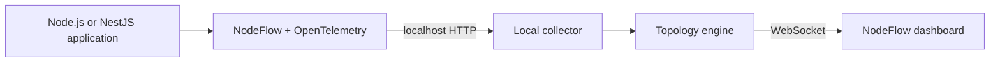
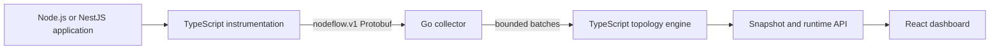

# NodeFlow

[](https://github.com/msHamed1/node-flow/actions/workflows/release.yml)
[](https://github.com/msHamed1/node-flow/actions/workflows/ci.yml)
[](https://www.npmjs.com/package/@mshamed1/node-flow)
[](https://www.npmjs.com/package/@mshamed1/node-flow)
[](https://www.npmjs.com/package/@mshamed1/node-flow)
[](./LICENSE)

**See your Node.js architecture execute in real time.**

NodeFlow is a local-first runtime architecture explorer for Node.js and NestJS applications. It
captures real application traffic and turns executed runtime paths into a live architecture map.

```text
POST /payments
      ↓
PaymentsController
      ↓
PaymentsService
   ↙             ↘
MongoDB       RabbitMQ
```

NodeFlow is not a static dependency diagram. Components appear only after they execute. Repeated
requests update the metrics on the same nodes and connections instead of creating duplicates.

NodeFlow is designed primarily for understanding application architecture during development. The
architecture graph is the product: raw OpenTelemetry spans are normalized into components,
executed dependencies, and aggregated runtime paths.

```text
Traditional observability: request → trace → span → latency

NodeFlow: runtime telemetry → semantic components → executed dependencies → runtime architecture
```

> **No business-function wrappers required.** No NodeFlow decorators, initialization calls, manual
> OpenTelemetry configuration, or tracing calls are required in normal controller and service
> code.

## Quick Start

Requirements: Node.js 20 or newer and an existing Node.js or NestJS application.

Install NodeFlow as a development dependency:

```bash
npm install -D @mshamed1/node-flow
```

NestJS applications should import `NodeFlowModule` once in the root module so the graph can show
semantic controllers and providers:

```ts
import { Module } from '@nestjs/common';
import { NodeFlowModule } from '@mshamed1/node-flow/nestjs';

@Module({ imports: [NodeFlowModule] })
export class AppModule {}
```

Start the application through NodeFlow using the same development command you already run:

```bash
npx node-flow dev -- npm run start:dev
```

Open [http://127.0.0.1:7331](http://127.0.0.1:7331), then use the application normally or send a
request with `curl`. The graph is derived from the routes, controllers, providers, databases,
caches, queues, and external services that actually execute. Telemetry stays in memory on your
machine and is not uploaded.

## What NodeFlow helps you understand

NodeFlow gives developers a visual answer to questions such as:

- Which controller and service handled this request?
- Which databases, queues, caches, or external APIs were called?
- Which dependency is slow?
- Where did an error happen?
- How often is a route or dependency used?
- What did one individual request do from start to finish?
- What architecture changed after this refactor?

The graph-first local dashboard includes:

- Semantic entrypoint, application, service, and infrastructure layers
- Architecture, traffic, latency, and error perspectives over the same graph
- Runtime-path selection with dimmed or hidden unrelated components
- Search across component names, types, entrypoints, and external services
- Navigable inbound and outbound dependencies with meaningful traffic shares
- Compact architecture and infrastructure summaries
- Conservative, deterministic topology observations
- Local before/after snapshot comparison with added, removed, and changed markers
- Recent request traces and architectural waterfalls

## Local-first and private

NodeFlow is designed for local development.

- The collector binds to `127.0.0.1`.
- Telemetry remains on the developer's machine.
- Runtime data is stored only in memory.
- Restarting NodeFlow clears the captured data.
- There are no accounts, API keys, analytics, cloud synchronization, or remote collectors.

Do not expose the NodeFlow collector or dashboard to a public network.

## How it works



The CLI starts the collector and bundled dashboard, configures the preload, and launches the
developer's normal command. The preload initializes OpenTelemetry before application libraries are
loaded. OpenTelemetry instruments supported infrastructure clients, while NodeFlow adds semantic
controller and provider boundaries and aggregates completed traces into a runtime map.

### NodeFlow V2 Go collector

V2 introduces an opt-in Go ingestion service without rewriting NodeFlow or moving Node.js-specific
instrumentation out of TypeScript:



Go owns the runtime-neutral infrastructure boundary: validation, bounded admission, batching,
fixed worker concurrency, backpressure, graceful shutdown, and collector metrics. TypeScript
continues to own Node.js/OpenTelemetry integration, NestJS discovery, semantic topology
reconstruction, snapshots, and the dashboard. The existing TypeScript collector remains the npm
CLI default while V2 parity and distribution mature.

The preferred V2 wire format is Protocol Buffers, while the existing JSON ingestion endpoints stay
available for compatibility. See [the V2 architecture](./docs/architecture-v2.md),
[migration design](./docs/migrations/collector-go-v2.md), and
[Go collector runbook](./services/collector/README.md).

## Release and compatibility

The current stable npm release is
[`@mshamed1/node-flow@1.0.0`](https://www.npmjs.com/package/@mshamed1/node-flow). NodeFlow requires
Node.js 20 or newer. Its public package surface, transitive runtime packages, CLI binary, exports,
bundled dashboard, package smoke tests, Changesets configuration, and npm trusted-publishing
workflow use the `@mshamed1` npm scope, with `@mshamed1/node-flow` as the primary package.

NodeFlow is licensed under Apache License 2.0. See [RELEASE.md](./RELEASE.md) for the one-time npm
bootstrap and the automated release process.

## Install in a NestJS application

Requirements:

- Node.js 20 or newer
- An existing NestJS application with `@nestjs/common`, `@nestjs/core`, and `rxjs`

Install one development dependency:

```bash
npm install -D @mshamed1/node-flow
```

### 1. Register the NestJS integration

Import `NodeFlowModule` once in the root application module:

```ts
import { Module } from '@nestjs/common';
import { NodeFlowModule } from '@mshamed1/node-flow/nestjs';
import { PaymentsModule } from './payments/payments.module';

@Module({
  imports: [NodeFlowModule, PaymentsModule],
})
export class AppModule {}
```

This is the only required application-source integration. The module installs one global
controller interceptor and discovers eligible singleton application providers once during
bootstrap.

### Why the NestJS module is still required

NodeFlow intentionally does not fake zero configuration by patching undocumented NestJS internals.
`NodeFlowModule` uses stable framework extension points:

- The public `DiscoveryModule` registers the public `DiscoveryService` in the application DI graph.
- Provider discovery runs once through the public `OnApplicationBootstrap` lifecycle.
- Controller visibility is registered through the public `APP_INTERCEPTOR` token.

A Node preload can activate NestJS request instrumentation, but NestJS does not expose a public
global observer that provides the completed application container and provider instances. Removing
the module today would require wrapping `NestFactory.create` and depending on internal container and
instance-wrapper behavior. Reliability across NestJS releases is more important than hiding one
explicit module import.

### 2. Keep normal business code

Services remain normal NestJS code:

```ts
import { Injectable } from '@nestjs/common';

@Injectable()
export class PaymentsService {
  constructor(private readonly paymentsRepository: PaymentsRepository) {}

  createPayment(input: CreatePaymentInput) {
    return this.paymentsRepository.create(input);
  }
}
```

NodeFlow safely instruments eligible singleton provider prototype methods after NestJS creates
their instances. Nested provider calls preserve their parent-child relationship through the active
OpenTelemetry context.

The topology aggregates provider methods under one stable class node:

```text
PaymentsService.createPayment
PaymentsService.validatePayment   → topology node: PaymentsService
PaymentsService.calculateFees
```

Individual traces retain the executed method names and durations.

### 3. Use infrastructure clients normally

Compatible clients are captured by OpenTelemetry. No NodeFlow-specific database call is required:

```ts
return this.dataSource.query(
  'INSERT INTO payments (amount, currency) VALUES ($1, $2) RETURNING id',
  [input.amount, input.currency],
);
```

### 4. Run through NodeFlow

After installing the package, use its local binary through `npx`:

```bash
npx node-flow dev -- npm run start:dev
```

Yarn users can invoke the same local binary directly:

```bash
yarn node-flow dev -- yarn start:dev
```

The CLI prints:

```text
NodeFlow started

Application command:
npm run start:dev

Runtime map:
http://127.0.0.1:7331

Press Ctrl+C to stop.
```

The CLI resolves the installed NodeFlow preload, preserves existing `NODE_OPTIONS`, avoids duplicate
preload entries, and launches the application with `NODEFLOW_COLLECTOR_URL`. Developers do not need
to configure `NODE_OPTIONS` themselves.

Open [http://127.0.0.1:7331](http://127.0.0.1:7331), then use the application normally or generate
traffic with integration tests and `curl`. Only executed components appear.

## Save and compare runtime architectures

Keep `node-flow dev` running, exercise the application, and create a snapshot from a second
terminal:

```bash
npx node-flow snapshot --output before.json
```

The command asks the active local collector for its derived architecture. Snapshot files contain
normalized nodes, executed dependencies, aggregate metrics, and repeated runtime paths; they do not
contain raw spans or recent trace waterfalls. With no `--output`, NodeFlow writes
`node-flow.snapshot.json` in the current directory.

After changing the application, restart NodeFlow, generate representative traffic again, and save
the new architecture:

```bash
npx node-flow snapshot --output after.json
npx node-flow compare before.json after.json
```

The comparison separates structural changes from meaningful runtime metric changes. Reordered JSON
arrays do not create false differences, and small timing drift is suppressed by conservative
thresholds. New external services and substantial latency increases are warnings; NodeFlow does not
claim critical business impact from topology alone.

Snapshots use schema version `1.0`. Component identity is deterministic and semantic rather than
span- or process-based. Examples include:

```text
nestjs:controller:paymentscontroller
nestjs:service:paymentsservice
database:postgresql
redis:redis
external-http:api.stripe.com
```

Identity values are trimmed, lowercased, normalized, and prefixed with the framework where that
semantic context exists. Edge identity derives only from the source and target component IDs. This
makes snapshots stable across startup order, process IDs, trace IDs, and JSON array order. Custom
`traceBoundary()` integrations should continue to use stable identities without request-specific
values.

## Optional custom spans

Automatic instrumentation covers normal controllers, singleton providers, and supported
infrastructure clients. The public package also exposes optional APIs for domain-specific detail or
unsupported clients.

Use `nodeflow.span()` for trace detail that should not become a main topology node:

```ts
import { nodeflow } from '@mshamed1/node-flow';

return nodeflow.span('calculate-settlement', () => this.calculateSettlement(input));
```

Use `traceBoundary()` only when an unsupported client needs an explicit architectural boundary:

```ts
import { traceBoundary } from '@mshamed1/node-flow';

return traceBoundary(
  {
    type: 'database',
    name: 'PostgreSQL',
    identity: 'database:postgresql:payments',
    operation: 'INSERT payments',
  },
  () => this.customDatabaseClient.insert(payment),
);
```

Keep `identity` stable. Do not include payment IDs, player IDs, timestamps, or other
request-specific values.

## What is captured

| Boundary                        | Behavior                                                      |
| ------------------------------- | ------------------------------------------------------------- |
| Incoming HTTP                   | Captured automatically when the app starts through NodeFlow   |
| NestJS controllers              | Captured after importing `NodeFlowModule`                     |
| NestJS singleton providers      | Discovered and instrumented once during application bootstrap |
| PostgreSQL                      | Captured through compatible OpenTelemetry instrumentation     |
| MongoDB                         | Captured when a compatible instrumented client is used        |
| Redis                           | Captured when a compatible instrumented client is used        |
| RabbitMQ/AMQP                   | Captured when compatible `amqplib` instrumentation is used    |
| Outgoing HTTP and `fetch`       | Captured automatically where supported                        |
| Custom trace detail             | Optionally use `nodeflow.span()`                              |
| Custom architectural boundaries | Optionally use `traceBoundary()`                              |

NodeFlow instruments architectural boundaries. It does not trace every JavaScript function.

## Dashboard metrics and storage

Each topology node and edge maintains request count, error count, error rate, average latency, and
p95 latency. Recent traces are stored separately from the aggregated graph so developers can inspect
individual requests without creating duplicate topology nodes.

Storage is intentionally bounded and process-local:

- Up to 50 recent traces by default
- Up to 1,000 latency samples per node or edge
- No NodeFlow database or persistent telemetry storage

## Optional configuration

NodeFlow works without configuration for the standard local setup. Filtering is available through
`forRoot()`:

```ts
import { NodeFlowModule } from '@mshamed1/node-flow/nestjs';

@Module({
  imports: [
    NodeFlowModule.forRoot({
      tracing: {
        services: true,
        controllers: true,
        excludeProviders: ['ConfigService', 'InternalHealthService'],
        minDurationMs: 1,
      },
    }),
  ],
})
export class AppModule {}
```

`excludeProviders` accepts exact class names. `minDurationMs` keeps faster provider method spans as
internal correlation spans. If a standalone configuration file is added later, the preferred
filename is `nodeflow.config.ts`.

## Environment variables

| Environment variable       | Default                  | Purpose                                     |
| -------------------------- | ------------------------ | ------------------------------------------- |
| `NODEFLOW_PORT`            | `7331`                   | Collector and dashboard port                |
| `NODEFLOW_HOST`            | `127.0.0.1`              | Collector bind host                         |
| `NODEFLOW_COLLECTOR_URL`   | `http://127.0.0.1:7331`  | Shared collector used by `node-flow run`    |
| `NODEFLOW_SERVICE_NAME`    | Application package name | Name reported by the instrumented process   |
| `NODEFLOW_DEBUG`           | Disabled                 | Set to `1` to log telemetry export failures |
| `NODEFLOW_EXPORT_PROTOCOL` | `json`                   | Use `protobuf` with the V2 Go collector     |

Example:

```bash
NODEFLOW_PORT=7441 \
NODEFLOW_SERVICE_NAME=payments-api \
npx node-flow dev -- npm run start:dev
```

The dashboard will be available at `http://127.0.0.1:7441`.

## NestJS monorepos

Install `@mshamed1/node-flow` in the workspace that owns the NestJS application, import
`NodeFlowModule` in that application's root module, and launch that workspace through NodeFlow.

For a Yarn Classic workspace named `@acme/payments-api`:

```bash
yarn workspace @acme/payments-api add --dev @mshamed1/node-flow
yarn workspace @acme/payments-api node-flow dev -- yarn workspace @acme/payments-api start:dev
```

For an npm workspace at `apps/payments-api`:

```bash
npm install --save-dev @mshamed1/node-flow --workspace apps/payments-api
cd apps/payments-api
npx node-flow dev -- npm run start:dev
```

The preload is inherited by child Node.js processes through `NODE_OPTIONS`. The normal `dev` command
owns one application and collector. For several local services, start a shared collector and point
each instrumented process at it:

```bash
npx node-flow collector
NODEFLOW_COLLECTOR_URL=http://127.0.0.1:7331 \
NODEFLOW_SERVICE_NAME=payments-api \
npx node-flow run -- yarn workspace @acme/payments-api start:dev
```

Repeat the `run` command with a distinct service name for each local process. This is the same
multi-process path exercised by the Docker integration lab.

A single NestJS application in a monorepo is fully supported. For example, launching an `api`
application instruments that application and singleton providers imported from `libs/*` when
NestJS instantiates them in the `api` container. NodeFlow follows executed runtime boundaries, not
the physical workspace directory that contains a provider.

Local `api`, `worker`, and `admin-api` processes can send telemetry to one collector. Explicit
service-group nodes and multi-host collection remain outside the current release.

## Try the included demo

Repository development uses Yarn Classic 1.22:

```bash
yarn install
yarn demo
```

NodeFlow starts the demo on `http://127.0.0.1:3000` and the runtime map on
`http://127.0.0.1:7331`.

In a second terminal, generate representative traffic for all demo flows:

```bash
yarn demo:traffic
```

The script executes 26 real HTTP requests. The dashboard will show three runtime paths:

```text
POST /auth/login → AuthController → AuthService → Redis

POST /payments → PaymentsController → PaymentsService
                                            ├─ MongoDB
                                            └─ RabbitMQ

POST /orders → OrdersController → OrdersService
                                      ├─ PostgreSQL
                                      └─ InventoryService → inventory.example.local
```

The demo uses optional `traceBoundary()` adapters to simulate infrastructure latency so Docker is
not required. The graph still results from real executed HTTP traffic and exported spans; no
topology is inserted directly. Controllers and services contain no tracing calls.

## Real integration demo

The Docker integration lab validates the package against actual infrastructure and the same public
surface an external NestJS application uses. It starts PostgreSQL, MongoDB, Redis, RabbitMQ, a
NestJS API, a NestJS queue worker, a local risk service, the V2 Go collector, and the existing
TypeScript topology/dashboard process. Instrumentation uses Protobuf through the Go boundary in
this environment.

Start the complete environment from the repository root:

```bash
yarn integration:up
```

This runs `docker compose up -d --build --wait`. When it completes, open:

- API: [http://127.0.0.1:3000](http://127.0.0.1:3000)
- NodeFlow dashboard: [http://127.0.0.1:7331](http://127.0.0.1:7331)
- Go collector metrics: [http://127.0.0.1:4318/metrics](http://127.0.0.1:4318/metrics)
- RabbitMQ management: [http://127.0.0.1:15672](http://127.0.0.1:15672)

RabbitMQ uses the demo-only username and password `nodeflow`. All local defaults are documented in
[.env.example](./.env.example); do not reuse them outside this disposable environment.

Run the primary flow:

```bash
curl -X POST http://127.0.0.1:3000/integration/full-flow \
  -H 'content-type: application/json' \
  -d '{"amount":125,"currency":"USD"}'
```

It executes this real runtime path:

```text
POST /integration/full-flow
  → IntegrationController
  → IntegrationService
      ├─ Redis SET NX (idempotency)
      ├─ PostgreSQL transaction: INSERT, SELECT, UPDATE
      ├─ Mongoose create + findById
      ├─ POST mock-risk-service/risk/check
      ├─ payment.created.local → AuditListener
      └─ RabbitMQ publish payments.created
           → PaymentWorker
              ├─ MongoDB/Mongoose persistence
              ├─ PostgreSQL UPDATE
              └─ RabbitMQ publish payments.settled
                   → settled-event consumer
```

The main topology aggregates the client operations into stable architecture nodes:

```text
HTTP route → IntegrationController → IntegrationService
                                      ├─ Redis
                                      ├─ PostgreSQL
                                      ├─ MongoDB
                                      ├─ mock-risk-service
                                      └─ RabbitMQ → PaymentWorker
```

Run the automated real-infrastructure assertions:

```bash
yarn integration:test
yarn integration:durability
```

The test executes 100 PostgreSQL transactions and verifies they remain one architecture node. It
also verifies every documented Mongoose and Redis operation, RabbitMQ producer and both consumer
paths, outgoing HTTP, the cache miss/hit path, the local event listener, one correlated API-to-worker
trace, and deterministic PostgreSQL, MongoDB, Redis, RabbitMQ, HTTP, business, and worker failures.
The durability scenario then stops the TypeScript sink, admits telemetry to the Go segmented WAL,
force-kills the Go process, and verifies restart replay and checkpoint compaction. The Go collector's
default delivery contract is at least once; the controlled scenario observes one canonical call but
does not claim exactly-once delivery.

The compact topology compatibility corpus can be run without Docker:

```bash
yarn test:golden
```

Focused fixtures are available at `POST /integration/postgres`, `/mongoose`, `/redis`, `/rabbitmq`,
and `/http`; the application flow is also exposed as `POST /payments`, `GET /payments/:id`, and
`GET /players/:id`. Trigger a deterministic failure without stopping infrastructure by passing one
of `postgres`, `mongodb`, `redis`, `rabbitmq`, `http`, `business`, or `worker`:

```bash
curl -X POST http://127.0.0.1:3000/integration/full-flow \
  -H 'content-type: application/json' \
  -d '{"amount":125,"currency":"USD","failAt":"mongodb"}'
```

Inspect service logs or reset the lab with:

```bash
yarn integration:logs
yarn integration:down
```

`integration:down` runs `docker compose down -v --remove-orphans` and deletes only the lab's named
database volumes.

### Verified compatibility

These versions were exercised together by the Docker suite; "verified" below means the real client
operation produced NodeFlow telemetry and passed the automated topology/trace assertions.

| Integration    | Tested client/framework                          | Tested service          | Result   |
| -------------- | ------------------------------------------------ | ----------------------- | -------- |
| NestJS         | `@nestjs/core` 11.2.1, `@nestjs/mongoose` 11.0.4 | Node.js 22.23.2         | Verified |
| PostgreSQL     | `pg` 8.23.0                                      | PostgreSQL 16.15        | Verified |
| Mongoose       | `mongoose` 8.24.3                                | MongoDB 7.0.40          | Verified |
| MongoDB driver | `mongodb` 6.20.0                                 | MongoDB 7.0.40          | Verified |
| Redis          | `redis` 4.7.1                                    | Redis 7.4.10            | Verified |
| RabbitMQ       | `amqplib` 0.10.9                                 | RabbitMQ 4.1.8          | Verified |
| Outgoing HTTP  | Node.js `fetch`                                  | local mock risk service | Verified |

The tested OpenTelemetry instrumentation versions are PostgreSQL 0.56.1, MongoDB 0.56.0,
Mongoose 0.50.0, Redis 0.52.0, amqplib 0.50.0, HTTP 0.203.0, Express 0.52.0, and Undici 0.14.0.

Mongoose `create()` produces Mongoose `save` plus MongoDB driver `insert` spans, and `findById()` is
reported as Mongoose `findOne`; the suite asserts those observed names. Mongoose and driver spans
retain their distinct operation names in recent traces but share one `MongoDB` topology identity,
preventing a `Mongoose → driver → MongoDB` architecture chain.

Nest `EventEmitter2` has no dedicated event semantic instrumentation. The realistic
`payment.created.local` case is present without manual tracing. NodeFlow's existing singleton
provider instrumentation sees `AuditListener.handlePaymentCreated`, but it does not currently model
an event publisher, event name, or event edge. Dedicated Nest event semantics are therefore a
worthwhile future compatibility improvement.

## Troubleshooting

### The dashboard is empty

Confirm that:

1. The application was started through `node-flow dev`.
2. A real request was sent after NodeFlow started.
3. `NodeFlowModule` from `@mshamed1/node-flow/nestjs` is imported by the root NestJS module.
4. The application process can reach `127.0.0.1:7331`.

### Routes and controllers appear, but services do not

The provider must be a singleton class with methods declared on its direct prototype. Request and
transient scopes, inherited methods, accessors, lifecycle hooks, and arrow functions stored as
instance properties are intentionally skipped to protect application behavior.

### The database does not appear

Check whether the client is one of NodeFlow's explicitly supported OpenTelemetry integrations. Use
`traceBoundary()` only for an unsupported or custom client.

### Port 7331 is already in use

```bash
NODEFLOW_PORT=7441 npx node-flow dev -- npm run start:dev
```

### No telemetry arrives

```bash
NODEFLOW_DEBUG=1 npx node-flow dev -- npm run start:dev
```

## Current limitations

- The current package set is published under the `@mshamed1` npm scope; this repository's pending
  Changeset controls the next release.
- One `NodeFlowModule` import remains required because NestJS has no public preload-to-container
  discovery hook.
- State is process-local and cleared on restart.
- Automatic provider discovery covers singleton class providers created during bootstrap.
- Request-scoped, transient, and dynamically created providers are intentionally skipped.
- Inherited methods, instance arrow functions, accessors, lifecycle hooks, framework providers, and
  NodeFlow providers are skipped.
- Several local processes can share one collector, but explicit service-group topology nodes are
  not yet modeled.
- Runtime paths expose reliable end-to-end request timing. The telemetry model does not yet store
  exclusive per-component path duration, so the explorer lists participating components without
  claiming component timings or summing nested span duration.
- Snapshot comparison runs entirely in the browser and requires selecting two local version `1.0`
  JSON files; snapshots are not persisted by the dashboard.
- Verified integration versions are intentionally narrow; other client and framework versions need
  separate compatibility runs before they are documented as verified.

## Repository development

```bash
yarn install --frozen-lockfile
yarn format:check
yarn build
yarn lint
yarn test
yarn package:check
yarn package:smoke
yarn integration:up
yarn integration:test
yarn integration:down
```

Use `yarn format` to apply Prettier. Contributors should read [CONTRIBUTING.md](./CONTRIBUTING.md) and
add a Changeset for user-visible package changes. Maintainers should follow [RELEASE.md](./RELEASE.md)
for first publication, trusted-publisher setup, recovery, prereleases, deprecation, and rollback.

The repository is hosted at `github.com/msHamed1/node-flow` and uses Yarn Classic 1.22 for
workspace dependency management.

## Release process

For every user-visible package change, run:

```bash
yarn changeset
```

Select `patch` for a backward-compatible fix, `minor` for a backward-compatible feature, or `major`
for a breaking change, then commit the generated `.changeset/*.md` file with the implementation.
After the pull request merges, GitHub Actions creates or updates the `Release packages` version pull
request. Merging that reviewed version pull request publishes through npm Trusted Publishing and
creates the corresponding tags and GitHub Releases. Ordinary commits without Changesets do not bump
or publish a package.

## Product scope

NodeFlow will remain local-first. Cloud accounts, remote telemetry, SaaS features, authentication,
and production monitoring are outside the current product scope.

The next SDK ergonomics improvement is optional `nodeflow.config.ts` loading through the CLI so
filtering does not require `NodeFlowModule.forRoot()`.
